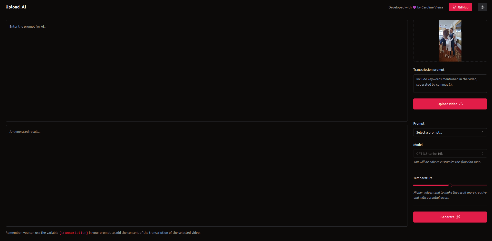

<div align="center" id="top">




</div>


<div align="center">
  <a href="#memo-project">Project</a>&nbsp;&nbsp;&nbsp;|&nbsp;&nbsp;&nbsp;
  <a href="#rocket-technologies">Technologies</a>&nbsp;&nbsp;&nbsp;|&nbsp;&nbsp;&nbsp;
  <a href="#clipboard-requirements">Requirements</a>&nbsp;&nbsp;&nbsp;|&nbsp;&nbsp;&nbsp;
  <a href="#keyboard-how-to-run-the-project">How to run the project </a>&nbsp;&nbsp;&nbsp;|&nbsp;&nbsp;&nbsp;
  <a href="#art-layout">Layout</a>&nbsp;&nbsp;&nbsp;|&nbsp;&nbsp;&nbsp;
</div>
<br>

---

## :memo: Project 

Welcome to the AI Video Title and Description Generator! This innovative application empowers content creators by automatically generating compelling titles and descriptions for their videos, optimizing indexing and discoverability.

Unleash the power of AI to supercharge your video content and make it stand out in the crowded online space. Say goodbye to the hassle of manually crafting titles and descriptions—let our cutting-edge AI algorithms do the heavy lifting for you.

### Features

- **Automated Title Generation:** Our AI analyzes your video content and generates catchy, relevant titles that grab viewers' attention.

- **Dynamic Description Creation:** Craft engaging video descriptions that not only provide essential information but also enhance SEO and discoverability.

- **Optimized Indexing:** Improve search engine optimization (SEO) by utilizing AI-generated metadata to enhance your video's visibility on platforms like YouTube and Vimeo.

- **User-Friendly Interface:** An intuitive and user-friendly interface ensures a seamless experience, whether you're a tech enthusiast or a novice content creator.

- **Customization:** Tailor generated titles and descriptions to align with your unique branding and style preferences.

- **Dark and Light Mode Toggle** seamlessly switch between dark and light modes to customize the application's appearance based on your preference or lighting conditions.Enhance user comfort and reduce eye strain during extended usage with the ability to choose between different visual modes.


This is a project developed during NLW AI, run by **[@Rocketseat](https://github.com/Rocketseat)** during september 11,12,13 and 14 2023.

<br>

---

## :rocket: Technologies ##

This project was developed using the following technologies:

- [React](https://pt-br.reactjs.org/)
- [TypeScript](https://www.typescriptlang.org/)
- [OpenAI](https://openai.com/)
- [FFmpeg.wasm](https://ffmpegwasm.netlify.app/docs/overview/)
- [Axios](https://axios-http.com/docs/intro)
- [Prisma](https://www.prisma.io/)
- [Fastify](https://fastify.dev/)
- [Zod](https://github.com/colinhacks/zod/)
- [TailwindCSS](https://tailwindcss.com/)
- [Vite](https://vitejs.dev/)

  
<br>

---

## :clipboard: Requirements

Before starting you need :checkered_flag:, have installed the [Git](https://git-scm.com) and [Node](https://nodejs.org/en/).
You must configure the .env file by setting the necessary key variables.

<br>

---
## :keyboard: How to run the project ##

```bash
# Clone this project
$ git clone git@github.com:Ca-byte/nlw-ai.git

# Access
$ cd upload-ai
$ cd upload-ai/web
$ cd upload-ai/upload-ai-server

# Install dependencies
$ npm install

# Run the project
$ npm run dev

# Run the prisma studio
$ npx prisma studio


# The server will initialize in the <http://http://localhost:5173//>

```
<br>

---


## :art: Layout ##

- [Shadcn/ui](https://ui.shadcn.com/) offers a set of reusable components that you can freely use, modify, and integrate into your projects by copying and pasting the code. It's a different approach compared to traditional component libraries that are installed as dependencies and imported into projects. This approach gives you greater flexibility and control over the components you use.

---

<br>

<p align="center">Developed with 💜 by Caroline Vieira</p>